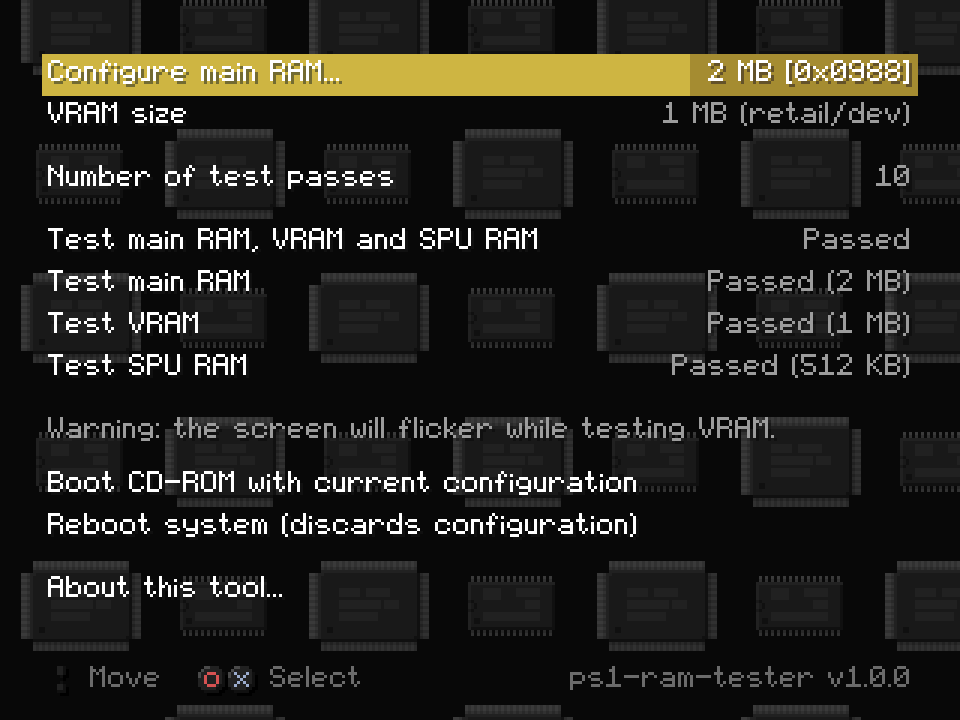
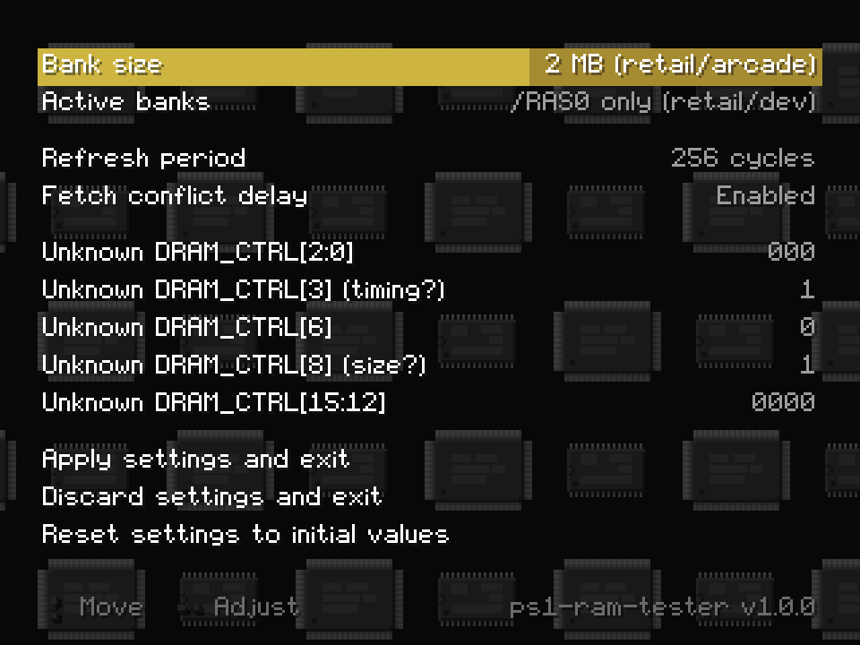
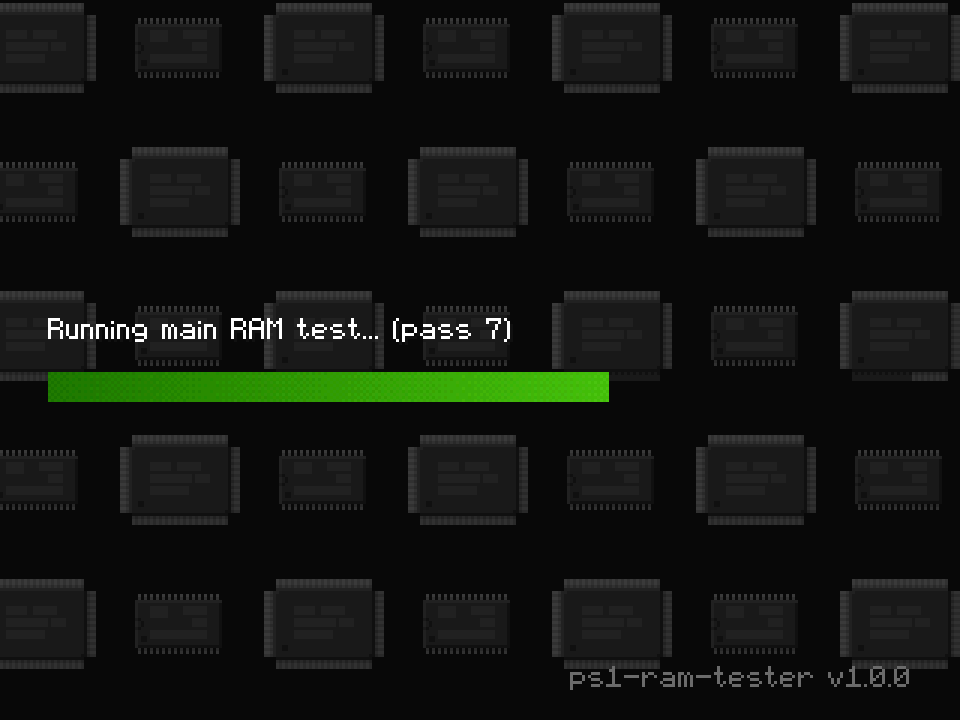

# PlayStation 1 RAM, VRAM and SPU RAM testing tool

This is a simple but feature-complete memory testing tool for the original Sony
PlayStation, allowing for exhaustive testing of all of the console's RAM chips:

- main RAM testing is fully supported, with proper handling of all
  configurations permitted by the CPU's DRAM controller (single or dual bank,
  1/2/4/8 MB per bank). In order to ease testing of PS1-based arcade boards and
  "upgraded" consoles with non-standard main RAM geometry, a menu is provided to
  edit all DRAM controller options, including ones whose purpose is currently
  unknown;
- VRAM testing is also fully supported. Console models equipped with the 208-pin
  GPU (all of them except for development units and a limited number of early
  SCPH-1xxx models) support extending VRAM to 2 MB by addressing a second bank,
  which may be enabled and tested if present;
- SPU RAM testing is currently limited to the standard 512 KB configuration. The
  SPU can allegedly be configured to address more than 512 KB (the ZN-1/ZN-2
  arcade PCBs have a jumper setting for 2 MB SPU RAM, and there is a register
  that *looks like* it may be related to RAM addressing), but this needs to be
  researched more in depth before the tester can support it.

This tester can also be used to launch a game or application from the CD-ROM
with customized default main RAM and VRAM configuration. This is useful for
instance to run ROM hacks or homebrew software that require additional memory
but do not explicitly initialize the DRAM controller.

Finally, this tester serves as a practical example of a simple C application
built on top of the
[ps1-bare-metal](https://github.com/spicyjpeg/ps1-bare-metal) headers and build
system.

## Download and usage

The latest version of the tester can be found on the releases page, accessible
through the GitHub sidebar. Each release is available as a CD-ROM image or as a
standalone PS1 executable file (e.g. for loading through a serial cable).

**NOTE**: the CD-ROM images contain license data suitable for Japanese region
consoles. They are compatible with all models and regions with the exception of
the PAL PSone, for which one of the following workarounds is required:

- installing a modchip with BIOS "region patching" functionality;
- patching the disc image with PAL license data prior to burning;
- launching via an intermediate loader that skips the license data checks in the
  BIOS shell such as Unirom or tonyhax;
- launching through disc swapping (not recommended).

## Screenshots

  
  
  

## Building the tester

This repository follows the same overall structure as ps1-bare-metal, so you may
refer to
[its build instructions](https://github.com/spicyjpeg/ps1-bare-metal#building-the-examples).

If MAME's `chdman` tool is installed and listed in your `PATH` environment
variable, it will be automatically used to generate a CHD version of the CD-ROM
image in addition to the raw `.iso` file. You may also specify its location
manually by passing `-DCHDMAN_PATH` to CMake while configuring the project.

## License

As with ps1-bare-metal, everything in this repository is licensed under the MIT
license (or the functionally equivalent ISC license). The only "hard"
requirements are attribution and preserving the license notice; you may
otherwise freely use any of the code for both non-commercial and commercial
purposes.

## See also

- The
  ["Memory Control" section of psx-spx](https://psx-spx.consoledev.net/memorycontrol)
  has further information on main RAM configuration.
- If you need help or wish to discuss PS1 homebrew development more in general,
  you may want to check out the
  [PSX.Dev Discord server](https://discord.gg/QByKPpH).
